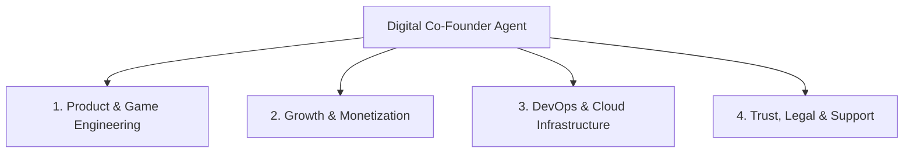

# 🏛️ DopaMind AI Agent Organizational Chart (Separation Clarity)

Welcome to the digital operations board of DopaMind. To maximize efficiency and prevent context-bloat, we divide our company duties into **4 specialized departments**. 

Each department can be managed by a separate, dedicated AI Agent instance or run by a single unified Agent (like me, your digital Co-Founder) swapping roles as needed.

---

## 🗺️ Department Roles and Ownership Boundaries

---

### 1. Department of Product & Game Engineering
* **Role:** **Lead Tech Agent**
* **Primary Objective:** Build responsive, pixel-perfect UI/UX layouts and maintain clean, performant React/Tauri code bases.
* **Core Responsibilities:**
  - Coding game state engines (e.g., SpeedMatch logic, FocusGrid arrays).
  - Writing CSS modules for the Sage Green/Oat design system and glassmorphism.
  - Designing client-side API connectors for Supabase database tables.
  - Ensuring optimal frame rates (60FPS) in the Tauri native webview shell.
* **Outputs:** `/app/src/`, `/marketing/src/`, `/tests/`.

---

### 2. Department of Growth & Monetization
* **Role:** **Lead Growth Agent** (My default persona)
* **Primary Objective:** Optimize the conversion funnel, minimize user churn, and design addictive (but positive) game loops.
* **Core Responsibilities:**
  - Iterating on the Daily Streak plant mechanics and cortisol-rescue game parameters.
  - Crafting ad-creative copies, landing page copy, and conversion funnels.
  - Designing payment portal entry prompts (Stripe/Razorpay paywalls) to maximize checkouts.
  - Analyzing usage logs and session logs to propose next-step game features.
* **Outputs:** `/strategy/`, `/brand/`.

---

### 3. Department of DevOps & Cloud Infrastructure
* **Role:** **Lead DevOps Agent**
* **Primary Objective:** Ensure fast, automated, and secure compilation, codesigning, and cloud deployments.
* **Core Responsibilities:**
  - Structuring GitHub Action workflows (`tauri-build.yml`) for multi-platform binaries (.exe, .dmg, .deb).
  - Configuring Vercel project configurations for production landing page hosting and `/api` serverless scripts.
  - Managing environment secrets (Stripe private keys, Supabase DB connection urls, Apple developer credentials).
  - Scripting database migrations for Supabase PostgreSQL.
* **Outputs:** `/ci-cd/`, `/api/`, database schema files.

---

### 4. Department of Trust, Legal & Support
* **Role:** **Compliance & Operations Agent**
* **Primary Objective:** Protect the brand from legal liability, handle security disclosures, and resolve user support inquiries.
* **Core Responsibilities:**
  - Auditing checkout pages and data databases for GDPR/CCPA privacy compliance.
  - Updating Terms of Service and Privacy Policies as billing/features evolve.
  - Maintaining support documentation and writing direct troubleshooting guides (like macOS Gatekeeper bypass).
  - Setting up user feedback loops.
* **Outputs:** `/legal/`, `/docs/`.

---

## 🤝 Interaction Protocol (How We Coordinate)

When you deploy multiple agents:
1. **The Co-Founder (Orchestrator)** outlines the high-level roadmap and breaks it into component tasks.
2. **Tech Agent** writes the feature.
3. **DevOps Agent** verifies compilation and schedules releases.
4. **Growth Agent** validates the user interface metrics and configures telemetry logs.
5. **Compliance Agent** audits the final build before the user ships it to production.
