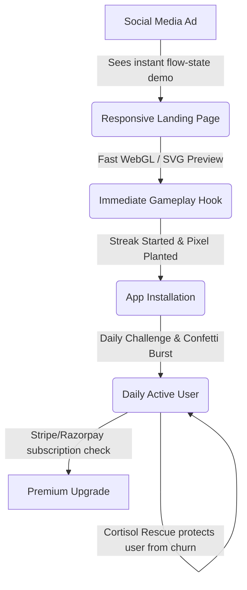

# 📈 DopaMind Growth & Retention Strategy

DopaMind is designed to convert social media ad traffic at a high rate and retain users through highly rewarding gamified mechanics. Unlike traditional mindfulness or calendar apps, DopaMind focuses on immediate, visual feedback loops.

---

## 🔁 The Core Engagement Loop

### 1. The Daily Streak "Pixel Plant"
* **The Visual Hook:** A tiny, pixel-art flower pot resides on the main dashboard.
* **Mechanic:** Playing the daily 45-second SpeedMatch session plants a seed. Each day of consecutive play waters the plant. It grows from a seed into a sprout, then a leafy plant, and eventually blooms flowers corresponding to milestones (7 days, 15 days, 30 days).
* **The Psychology:** Loss aversion. If a user misses a day, the plant droops, and their streak is visually interrupted. Users can buy a "Streak Water Shield" via micro-transactions or share the app to preserve their streak once a month.

### 2. Failure De-escalation (Cortisol Rescue)
Traditional games penalize mistakes heavily, causing user frustration and churn. DopaMind rescues the user's focus:
* **The Trigger:** 2 consecutive incorrect answers in speed matching or pattern sequence.
* **The Action:**
  1. The speed threshold resets back to a relaxed base level (e.g. from 1.0s to 2.2s).
  2. The game prioritizes generating highly obvious, simple configurations (e.g., matching colors or shapes) to guarantee an immediate correct response.
  3. Correcting the next 2 items triggers a soft positive audio chime, boosting confidence, resetting the streak, and preventing immediate closure of the app in frustration.

### 3. Audiovisual Gratification
* **Confetti Bursts:** Completing a 45-second round triggers a canvas confetti particle burst.
* **Musical Progression:** Correct responses play ascending notes in a pentatonic scale. The scale wraps and resets on errors, driving users to maintain runs to hear the complete melody.

---

## 📣 Marketing & Ad Strategy

### 1. The Visual Flow-State Ad (Meta, TikTok)
* **Visual:** Split screen. 
  - **Top half:** A user frantically (but successfully) playing SpeedMatch with glowing, springy animations.
  - **Bottom half:** A live EEG graph showing "High Beta / Focus Wave" state or simply a satisfying aesthetic loop.
* **Copy:** *"Doomscrolling is shrinking your focus window. Rebuild your attention span in 45 seconds a day."*

### 2. The Interactive Web Previews
The marketing landing page features a simplified, interactive web version of **SpeedMatch** written in lightweight React. Users can play a 15-second trial directly in their browser without registering. After 15 seconds, a beautiful glassmorphic paywall appears:
* *"You have a focus speed of 1.4s (Faster than 82% of users). Save your streak and plant your first seed."*
* Large **[Download for Windows / macOS]** buttons.
